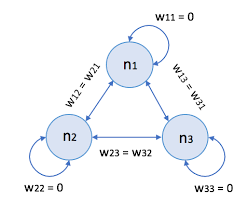

# Overview

ホップフィールドネットワーク(Hopfield Network: HN)のPythonでの実装です。


# Description

ホップフィールドネットワークは以下の２つの特徴を持つネットワークである。
1. 相互結合型  
2. 非同期型  

なお、自己結合係数は0となり、細胞間の双方向の結合係数が等しい。  



HNN は、大きく 以下2段階の動作をする。

- 学習 ( Training ): 与えられた学習データをネットワークの内部状態として記憶する
- 更新 ( Updating ): 新しい入力値を受け取り、学習したデータのうちどれに近いかを思い出して出力する

詳細なアルゴリズムに関しては [こちらのページ](http://sinhrks.hatenablog.com/entry/2014/12/30/221538)
を参考にされたい。

# create envs

Condaがインストールされていることが前提。

```commandline
conda create -n ${PROJECT_NAME} python=3.6
```

仮想環境に入る

```commandline:for windows
activate ${PROJECT_NAME}
```

```commandline:for mac
source activate ${PROJECT_NAME}
```

# Requirement / install package

```commandline
pip install numpy
pip install opencv-python
```

# Demo / Usage 

```commandline
python source/hop_field_network.py
```

トレーニングデータを用いて記憶した後、
テストデータを用いてネットワークが記憶を思い出すデモ。  
トレーニングデータ画像とテストデータ画像、および認識の途中経過の画像を表示する。
ターミナルで動くか確認していないです。  

# Licence
This software is released under the MIT License, see [LICENCE.txt](LICENCE.txt)
</code>
